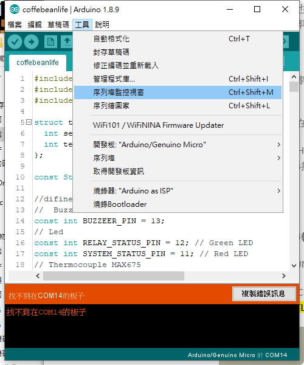

# AT模式 & AT指令

傳統藍牙模組(HC-05與HC-06)提供兩種操作模式。

1. 透通模式(transparent communication mode)：透通模式又稱為自動連線模式(automatic connection)。一般我們使用藍芽去進行資料傳輸與接收就是所謂透通模式，模組本身只負責資料傳送，並不會進行資料解讀。

2. AT模式(AT mode)：又稱為命令回應(order-response)模式，就是透過指令方式對藍芽模組本身進行操控，AT模式下是透過TX與RX來進行資料傳送與接收，而在AT模式下進行操控指令被稱為`AT指令(AT commend)`。

下面主要是針對AT模式與AT指令進行相關說明。

## AT模式(AT mode)

有兩種方式可以讓電腦透過USB port連接到HC-05，並進入AT Mode。

1. 利用Arduino板子
2. 利用USB to TTL模組

下面為使用USB to TTL連接HC-05 pin腳連接對應表

利用USB to TTL連接HC-05

|USB to TTL | HC-05 |
|-----------|-------|
| 5v        | VCC   |
| GND       | GND   |
| RXD       | TXD   |
| TXD       | RXD   |

> PS1. 當HC-05成功進到AT Mode後，模組上的LED燈將會從快送閃爍變成兩秒閃爍一次。
>  
> PS2. 有些HC-05模組上會有一個小顆圓形按鈕，當使用該類型板子使必須常該按鈕後在通電，後續才能進入AT Mode

成功進入AT Mode後，可以使用另一款終端機軟體就可以進入AT指令操作了，EX:Putty、RealTerm或AccessPort，或者也可以直接使用Arduino IDE上鎖提供的序列鋪阜監控視窗也可以進行AT指令操作了。

## HC-05上常見AT指令(AT commend)

| 指令 | 回應 | 參數 | 說明 |
|-----------|-------------------------|------|------|
|AT         | OK                      |      | 確認是否進入AT Mode |
|AT+ORGL   | OK                      |    | 回付出廠設定 |
|AT+VERSION     | +VERSION：`Param`   OK| 韌體版本號 |
|AT+ADDR?     | +ADDR:`address`   OK| 位址 |
|AT+NAME=`name` | OK |`name` : 裝置名稱  | 修改裝置名稱 |
|AT+NAME? | +NAME:`name`   OK |  | 查看裝置名稱，HC-05預設裝置名稱為`HC-05` |
|AT+PSWD=`password` | OK |`password` : 配對密碼  | 修改裝置配對密碼 |
|AT+PSWD? | +PSWD:`password`   OK |  | 查看裝置配對密碼，HC-05預設配對密碼為`1234` |
|AT+BAUD=`baud` | OK |`baud` : 鮑率  | 修改鮑率,EX: AT+BAUD=9600,0   |
|AT+BAUD? | +UART:`baud`   OK |  | 查看目前鮑率，預設配對密碼為`9600` |
|AT+ROLE=`role` | OK |`role` : role id  | 修改角色(master / salve), EX: AT+BAUD=0  |
|AT+ROLE? | +ROLE:`role`   OK |  | 查看目前角色，預設值為`0` |

> 因為廠商不同，可能會造成某些官方文件上有的AT Commend，實際使用上卻不支援。上述所列出指令為基本指令，故幾乎所有HC-05都支援

### baud

| 鮑率    | 說明      |
|--------|-----------|
| 1200   |           |
| 2400   |           |
| 4800   |           |
| 9600   | 原廠預設值 |
| 38400  |           |
| 57600  |           |
| 115200 |           |

### role id

| id | 說明         |
|----|--------------|
| 0  | Salve，預設值 |
| 1  | Master       |
| 2  | Salve-Loop   |
